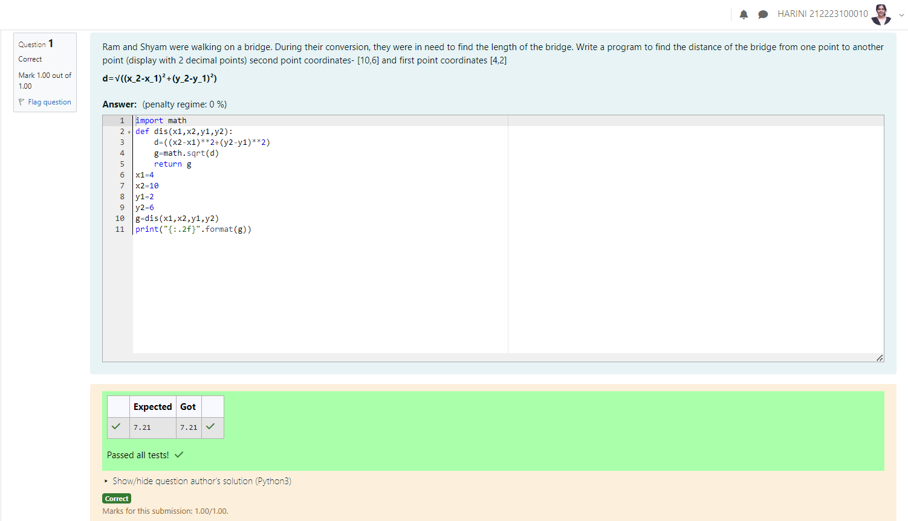

# DISTANCE-BETWEEN-TWO-POINTS

## AIM:
To write a python program to find the distance two 2 points
## ALGORITHM:
### Step 1: 
Get the input from the user

### Step 2: 
### Step 3: 
Substitute the values in the distance formula  

### Step 4: 
Then get the Output

### Step 5: 
### PROGRAM:


`````
DISTANCE BETWEEN TWO POINTS
DEVELOPED BY: HARINI R
REGISTER NUMBER: 212223100010

import math
def dis(x1,x2,y1,y2):
    d=((x2-x1)**2+(y2-y1)**2) 
    g=math.sqrt(d)
    return g
x1=4
x2=10
y1=2
y2=6
g=dis(x1,x2,y1,y2)
print("{:.2f}".format(g))
`````

### OUTPUT:

### RESULT:
Hence, the distance between two points is successfully found.